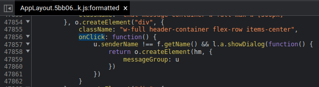

（未完成。單純推上來留紀念。）

# [Module] CCO: 右側切換公會頻道

注意：需安裝核心模組 [[Core] CCO 自定義工具核心模組](#)

嘗試在原生介面上加上右側的公會頻道切換。  
沒有任何使用任何額外請求，不會造成伺服器的負擔。

## 功能
- 支援右側公會頻道
  - 最多支援至 256 條訊息 【註1】
  - 支援基本訊息操作
    - 發訊息
    - 回覆特定玩家
    - 搜尋玩家

## 侷限
- 不支援原生的對話框，包含：
  - 封鎖該玩家
  - 查看個人檔案
  - 查看公會
  - 送禮物
  - 發送私人訊息

若有上述需求請回到原生的公會頻道區塊操作。  
若想知道是什麼造成這個侷限的話，請見下方【註2】

## 圖片參考
圖片

## 備註
- 【註1】  
    原生上限 32 條訊息。  
    我覺得這數字太小了實在不夠用，所以把預設值調到了 128 條。  
    不過如果重整網頁的話，依然只會抓前 32 筆資料出來。  
    提醒：太多訊息可能會造成網頁卡頓，請謹慎使用。
- 【註2】  
    由於是額外強行擴充的，因此有些原生功能沒辦法完美復刻。  
    例如點擊訊息會跳出該玩家的相關操作，那個部分我能力不足，抓不到可調整的環節，所以也就沒辦法自由使用了。  

      
    (關鍵函式在客戶端程式碼中的位置，其中的 onClick 是一個無參數傳入的函式)

    針對這個部分，我只好把功能簡化到點擊名稱時自動啓動回覆模式，這是我的極限了。