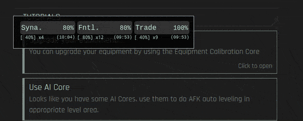

# [Module] CCO: 顯示全球增益

嘗試在原生介面上加上全球效應顯示。  
沒有任何使用任何額外請求，不會造成伺服器的負擔。

## 相容性
- Chrome >= 80
- (未測試) Edge >= 80
- (未測試) Firefox >= 103

## 安裝

0. 需安裝 Tampermonkey 這類管理使用者腳本的擴充元件，並且也建議使用 Tampermonkey。 [[Chrome](https://chrome.google.com/webstore/detail/tampermonkey/dhdgffkkebhmkfjojejmpbldmpobfkfo)] [[Firefox](https://addons.mozilla.org/en-US/firefox/addon/tampermonkey/)] [[Edge](https://microsoftedge.microsoft.com/addons/detail/tampermonkey/iikmkjmpaadaobahmlepeloendndfphd)]
1. 需安裝核心模組 [[Core] CCO 自定義工具核心模組](../CoreModule/readme.md)
2. [點我安裝這個模組（[Module] CCO: 顯示全球增益）](https://github.com/CCO-Project/userscripts/raw/master/TopGlobalBuffs/index.user.js)

## 功能
- 在主要操作介面上顯示全球效應
  - 自動計算同類型效應的總效果
  - 顯示時間精準到秒鐘
  - 只顯示六種特定效應：
    - 突觸 Syn.
    - 額葉 Frnt.
    - 交易 Trade
    - 校準 Cali.
    - 防爆 Prot.
    - RNG RNG

## 圖片參考
  
(v1.1)

## 已知問題
- 拖移過快時可能導致滑鼠跑得比浮窗還快，導致操作體驗不佳

## 版本歷史
- **v1.2.1 修正總效益的醒目提示錯誤**
- **v1.2 修正一堆錯誤，調整樣式**
  - 修正總效益醒目提示的判斷問題 - 現在要扣除即將到期的效應後仍低於最大值才會亮紅燈，否則只會作用在個別效應
  - 修正拖移浮窗可能超出視窗的問題
  - 修改秒數取整方法 - 改用與原生介面一致的向上取整
    - 影響醒目顯示時間 (00:01 ~ 01:00 將顯示爲紅色)
    - 最小時間顯示爲 00:01
  - 修改非校準類效果的對齊字元寬度
  - 調整倒數時間的格式 - 現在沒有括號了
  - 調整非防爆或 RNG 的最小寬度
  - 綁定原始資料 `buffs` 至 `.global-buffs-area` 元素上
- **v1.1 修正一堆錯誤，調整樣式**
  - 修正無全球效應時的錯誤
  - 修正無法拖移浮窗的錯誤
  - 增加醒目提示，用於即將到期的效應。（倒數時間 < 01:00）
  - 增加 `__debug_all_errors` 變數以協助除錯
  - 增加 `__example` 函式以方便測試
- **v1.0 修正一堆錯誤，改成浮窗顯示**
  - 修正當有效果過期時會瘋狂更新狀態介面的問題
  - 修正跨平台的字體顯示差異導致的介面跑版問題（去你的 Windows）
  - 改了不少樣式
  - 特別感謝 [ChaosOp](https://github.com/ChaosOp) 提供了 `initDrag` 這個函式 :heart:
- **v0.1 基本功能完成（此時仍置頂於介面上方）** 