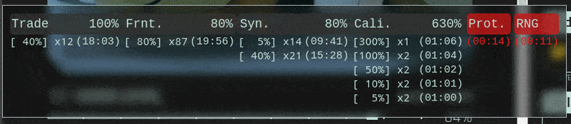

# [Module] CCO: 顯示全球增益

注意：需安裝核心模組 [[Core] CCO 自定義工具核心模組](../CoreModule/readme.md)

[點我安裝這個模組](https://github.com/CCO-Project/userscripts/raw/master/TopGlobalBuffs/index.user.js)

嘗試在原生介面上加上全球效應顯示。  
沒有任何使用任何額外請求，不會造成伺服器的負擔。

## 功能
- 在主要操作介面上顯示全球效應
  - 自動計算同類型效應的總效果
  - 顯示時間精準到秒鐘
  - 只顯示六種特定效應：
    - 突觸 Synapse
    - 額葉 Frontal
    - 交易 Transaction
    - 校準 Calibration
    - 防爆 Cali. Safety
    - RNG RNG

## 圖片參考

(v1.1)
